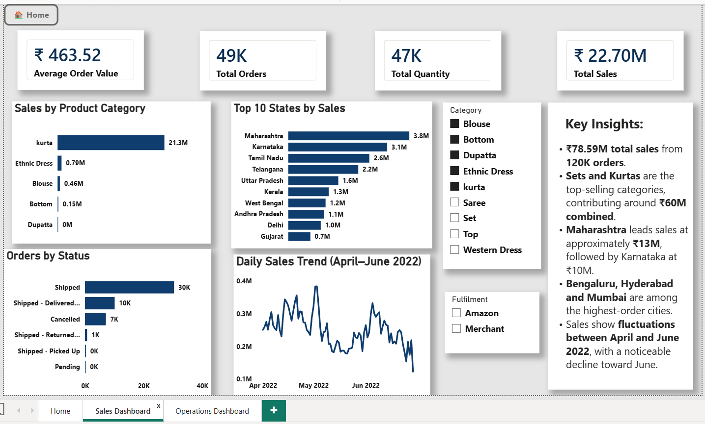
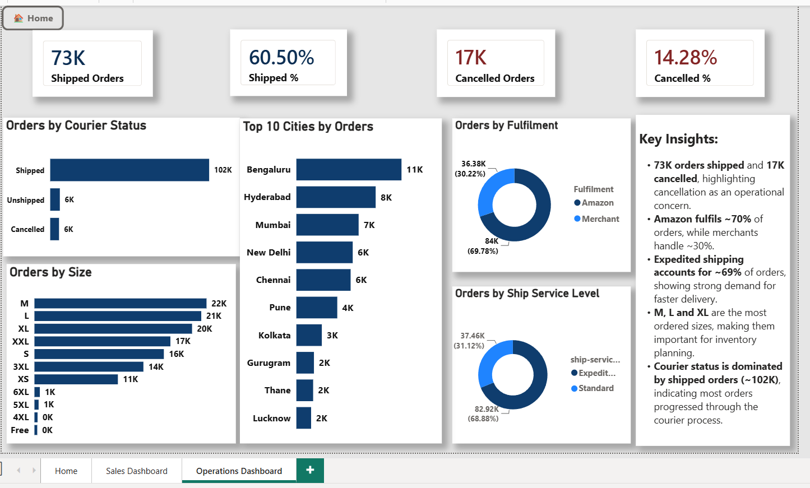

# 📊 Amazon Sales Analysis

An end-to-end **Amazon Sales Analysis project** using **SQL, Power Query, and Power BI** to transform raw e-commerce data into meaningful business insights through interactive dashboards.

## 📌 Project Overview

This project analyzes **128K+ Amazon sales records** to understand sales performance, product demand, customer ordering patterns, and fulfilment operations.

The project combines **data cleaning, SQL analysis, and Power BI visualization** to provide a clear view of both **sales performance and operational efficiency**.

## 🛠️ Tools & Technologies

* **SQL** — Data validation, analysis, and business queries
* **Power Query** — Data cleaning and transformation
* **Power BI** — Interactive dashboard development and visualization
* **Excel/CSV** — Source data

## 🔄 Project Workflow

**Raw Data → Data Cleaning → SQL Analysis → Power BI → Business Insights**

### 🧹 Data Cleaning & Transformation

The raw Amazon sales data was cleaned and transformed using Power Query.

Key steps included:

* Handling missing values
* Standardizing date formats
* Cleaning inconsistent categorical values
* Correcting data types
* Preparing the dataset for analysis

### 🗄️ SQL Analysis

SQL was used for data validation and business-focused analysis, including:

* Sales and order analysis
* Quantity analysis
* Category performance
* Size-wise analysis
* Geographic analysis
* Fulfilment analysis
* Shipping analysis
* Order and courier status analysis

---

## 📊 Dashboard 1 — Sales Performance

This dashboard focuses on overall sales performance, product categories, geographic distribution, ordering patterns, and sales trends.

### 🔍 Key Insights

* **₹78.59M total sales** from **120K orders**.
* **Sets and Kurtas** are the top-selling categories, contributing around **₹60M combined**.
* **Maharashtra** leads sales at approximately **₹13M**, followed by **Karnataka at ₹10M**.
* **Bengaluru, Hyderabad, and Mumbai** are among the highest-order cities.
* Sales show **fluctuations between April and June 2022**, with a noticeable decline toward June.

---

## ⚙️ Dashboard 2 — Fulfilment & Operations

This dashboard focuses on order fulfilment, shipping preferences, product sizes, and courier performance.

### 🔍 Key Insights

* **73K orders shipped** and **17K cancelled**, highlighting cancellation as an operational concern.
* **Amazon fulfils ~70%** of orders, while merchants handle **~30%**.
* **Expedited shipping accounts for ~69%** of orders, showing strong demand for faster delivery.
* **M, L, and XL** are the most ordered sizes, making them important for inventory planning.
* Courier status is dominated by **shipped orders (~102K)**, indicating most orders progressed through the courier process.

---

## 🎯 Business Value

The analysis provides insights that can support:

* **Sales performance monitoring**
* **Product and inventory planning**
* **Regional sales understanding**
* **Fulfilment optimization**
* **Shipping strategy analysis**
* **Order cancellation monitoring**

This project demonstrates how raw e-commerce data can be transformed into **clear, decision-oriented business insights** using SQL and Power BI.

---

## 📁 Project Files

* **Power BI Report** — The `.pbix` file is available in the `powerbi` folder.
* **SQL Queries** — Data validation and business analysis queries are available in the `sql` folder.
* **Dashboard Previews** — Final dashboard screenshots are available in the `images` folder.

---

## 🚀 Skills Demonstrated

* Data Cleaning & Transformation
* SQL
* Exploratory Data Analysis
* Business Analysis
* KPI Development
* Power Query
* Power BI
* Data Visualization
* Dashboard Design
* Business Insight Generation

---

## 👩‍💻 Author

**Tanusri Nowpada**

---

⭐ **If you found this project useful, feel free to explore the Power BI report and SQL analysis included in this repository.**
